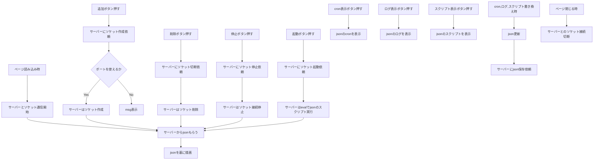
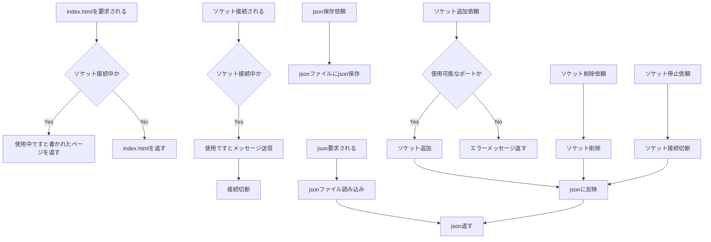

unifast
クライアント側

```mermaid
graph TD;

ページ読み込み時-->
サーバーとソケット通信開始-->
サーバーからjsonもらう-->
jsonを基に描画


追加ボタン押す-->
サーバーにソケット作成依頼-->
A{ポートを使えるか}
A-->|Yes|サーバーはソケット作成-->
サーバーからjsonもらう
A-->|No|msg表示


削除ボタン押す-->
サーバーにソケット切断依頼-->
サーバーはソケット削除-->
サーバーからjsonもらう

停止ボタン押す-->
サーバーにソケット停止依頼-->
サーバーはソケット接続停止-->
サーバーからjsonもらう


起動ボタン押す-->
サーバーにソケット起動依頼-->
サーバーはevalでjsonのスクリプト実行-->
サーバーからjsonもらう

cron表示ボタン押す-->
jsonのcronを表示

ログ表示ボタン押す-->
jsonのログを表示

スクリプト表示ボタン押す-->
jsonのスクリプトを表示


cron,ログ,スクリプト書き換え時-->
json更新-->
サーバーにjson保存依頼


ページ閉じる時-->
サーバーとのソケット接続切断

```

unifast
サーバー側

```mermaid
graph TD;


index.htmlを要求される-->
A{ソケット接続中か}
A-->|Yes|使用中ですと書かれたページを返す
A-->|No|index.htmlを返す


ソケット接続される-->
B{ソケット接続中か}
B-->|Yes|使用ですとメッセージ送信-->
接続切断

json要求される-->
jsonファイル読み込み-->
json返す

json保存依頼-->
jsonファイルにjson保存

ソケット追加依頼-->
C{使用可能なポートか}
C-->|Yes|ソケット追加-->
jsonに反映-->
json返す

C-->|No|エラーメッセージ返す


ソケット削除依頼-->
ソケット削除-->
jsonに反映


ソケット停止依頼-->
ソケット接続切断-->
jsonに反映
```